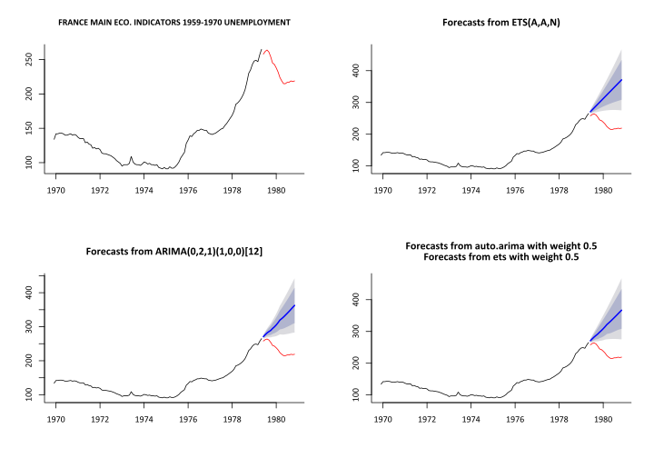

Prediction intervals for ensemble time series forecasts
========================================================
author: Peter Ellis
date: December 2016
autosize: true


The only credible test...
========================
transition: none
### M1
<!-- html table generated in R 3.3.2 by xtable 1.8-2 package -->
<!-- Wed Nov 09 18:07:28 2016 -->
<table border=1>
<tr> <th>  </th> <th> Period </th> <th> DEMOGR </th> <th> INDUST </th> <th> INDUSTRIAL </th> <th> MACRO1 </th> <th> MACRO2 </th> <th> MICRO1 </th> <th> MICRO2 </th> <th> MICRO3 </th>  </tr>
  <tr> <td align="right"> 1 </td> <td> MONTHLY </td> <td align="right"> 75 </td> <td align="right"> 183 </td> <td align="right"> 0 </td> <td align="right"> 64 </td> <td align="right"> 92 </td> <td align="right"> 10 </td> <td align="right"> 89 </td> <td align="right"> 104 </td> </tr>
  <tr> <td align="right"> 2 </td> <td> QUARTERLY </td> <td align="right"> 39 </td> <td align="right"> 17 </td> <td align="right"> 1 </td> <td align="right"> 45 </td> <td align="right"> 59 </td> <td align="right"> 5 </td> <td align="right"> 21 </td> <td align="right"> 16 </td> </tr>
  <tr> <td align="right"> 3 </td> <td> YEARLY </td> <td align="right"> 30 </td> <td align="right"> 35 </td> <td align="right"> 0 </td> <td align="right"> 30 </td> <td align="right"> 29 </td> <td align="right"> 16 </td> <td align="right"> 29 </td> <td align="right"> 12 </td> </tr>
   </table>
Makridakis et al, 1982

The only credible test...
============
transition: none
### M3
<!-- html table generated in R 3.3.2 by xtable 1.8-2 package -->
<!-- Wed Nov 09 18:07:29 2016 -->
<table border=1>
<tr> <th>  </th> <th> Period </th> <th> DEMOGRAPHI- </th> <th> DEMOGRAPHIC </th> <th> FINANCE </th> <th> INDUSTRY </th> <th> MACRO </th> <th> MICRO </th> <th> OTHER </th>  </tr>
  <tr> <td align="right"> 1 </td> <td> MONTHLY </td> <td align="right"> 0 </td> <td align="right"> 111 </td> <td align="right"> 145 </td> <td align="right"> 334 </td> <td align="right"> 312 </td> <td align="right"> 474 </td> <td align="right"> 52 </td> </tr>
  <tr> <td align="right"> 2 </td> <td> OTHER </td> <td align="right"> 0 </td> <td align="right"> 0 </td> <td align="right"> 29 </td> <td align="right"> 0 </td> <td align="right"> 0 </td> <td align="right"> 4 </td> <td align="right"> 141 </td> </tr>
  <tr> <td align="right"> 3 </td> <td> QUARTERLY </td> <td align="right"> 57 </td> <td align="right"> 0 </td> <td align="right"> 76 </td> <td align="right"> 83 </td> <td align="right"> 336 </td> <td align="right"> 204 </td> <td align="right"> 0 </td> </tr>
  <tr> <td align="right"> 4 </td> <td> YEARLY </td> <td align="right"> 0 </td> <td align="right"> 245 </td> <td align="right"> 58 </td> <td align="right"> 102 </td> <td align="right"> 83 </td> <td align="right"> 146 </td> <td align="right"> 11 </td> </tr>
   </table>
Makridakis et al, 2000

The only credible test...
==============
transition: none
### Tourism
<!-- html table generated in R 3.3.2 by xtable 1.8-2 package -->
<!-- Wed Nov 09 18:07:29 2016 -->
<table border=1>
<tr> <th>  </th> <th> Period </th> <th> TOURISM </th>  </tr>
  <tr> <td align="right"> 1 </td> <td> MONTHLY </td> <td align="right"> 366 </td> </tr>
  <tr> <td align="right"> 2 </td> <td> QUARTERLY </td> <td align="right"> 427 </td> </tr>
  <tr> <td align="right"> 3 </td> <td> YEARLY </td> <td align="right"> 518 </td> </tr>
   </table>
Athanasopoulos et al, 2011

UNITED NATIONS COPPER ORE PRODUCTION CANADA
==========================


```r
forecast_comp(M1[[650]], plot = TRUE) 
```


RATIO CIVILIAN EMPLOYMENT TO TOTAL WORKING AGE POPULATION
==========================


```r
forecast_comp(M1[[1000]], plot = TRUE) 
```


Ensemble time series work better than individual models
========================================================

- Bates and Granger (1969) [The Combination of Forecasts](https://www.jstor.org/stable/3008764?seq=1#page_scan_tab_contents)
- Many confirmations since.

## For example:
<!-- html table generated in R 3.3.2 by xtable 1.8-2 package -->
<!-- Wed Nov 09 18:07:31 2016 -->
<table border=1>
<tr> <th> model </th> <th> two </th> <th> four </th> <th> six </th> <th> eight </th>  </tr>
  <tr> <td> Theta </td> <td align="right"> 0.77 </td> <td align="right"> 1.06 </td> <td align="right"> 1.35 </td> <td align="right"> 1.62 </td> </tr>
  <tr> <td> ARIMA-ETS average </td> <td align="right"> 0.72 </td> <td align="right"> 1.07 </td> <td align="right"> 1.38 </td> <td align="right"> 1.75 </td> </tr>
  <tr> <td> ARIMA </td> <td align="right"> 0.75 </td> <td align="right"> 1.12 </td> <td align="right"> 1.43 </td> <td align="right"> 1.79 </td> </tr>
  <tr> <td> ETS </td> <td align="right"> 0.75 </td> <td align="right"> 1.11 </td> <td align="right"> 1.44 </td> <td align="right"> 1.82 </td> </tr>
  <tr> <td> Naive </td> <td align="right"> 1.08 </td> <td align="right"> 1.11 </td> <td align="right"> 1.74 </td> <td align="right"> 1.87 </td> </tr>
   </table>
*Mean absolute scaled error of forecasts for 756 quarterly series from the M3 competition, forecast horizon ranging from two to eight quarters.*


===================================================


=================================


How to estimate prediction intervals?
========================
- Usually presumed some kind of weighted average of the components
- Weights might be estimated based on in-sample errors

But the components have poor coverage. 
===========================


Standard estimates for prediction intervals are conditional on the model being correct, despite the obvious randomness in model selection.

A conservative alternative
===================

- Take the extremes of the combined prediction interval coverage of the components of the ensemble - but:

> "Those prediction intervals look dodgy because they are way too conservative. The package is taking the widest possible intervals that includes all the intervals produced by the individual models. So you only need one bad model, and the prediction intervals are screwed."


Definitely too wide...
============


This particular example is a combination of five forecast methods

Let's test against a larger set of data
============

Taking into account past findings that lower freqency data has an increased tendency to overestimate the coverage of forecast prediction intervals.

- Makridiakis et al. (1987) 
- Athanasopoulos et al (2011) 


=====================


=====================


=====================


When it works
===================

================


================


================


================


Some examples of when it goes all wrong
==========================

===============


===============


===============


Summary of performance
=================


Conclusions
=========================

- Confirm that higher frequency leads to more accurate advertised coverage
- Domain makes a real difference.  The original tourism data ETS prediction intervals have accurate or even better coverage than advertised for all seasonal data, but only for monthly in M3 and never in M1
- For 80% prediction intervals and seasonal data, the trial method has too high coverage in the Tourism and M3 competitions, but not in M1
- For non-seasonal data, even the trial method isn't conservative anough, in all three competitions, for 80% or 95% intervals
- The trial conservative  method gives good results for 95% confidence intervals of seasonal data - better than the individual components

Practical implications
=====================
- Ok (ie better than alternatives) to use this method for 95% confidence intervals...
- ... and for 80% confidence intervals for quarterly and yearly data
- but too conservative for monthly or more frequent 80% confidence intervals


Not considered today
====================
- implications of having more than two models in the combination
- Box-Cox transformations
- what happens when seasonal data is aggregated up to lower frequency
- implications of coordination by hierarchy (`hts`) or temporal aggregation (`thief`)


Today's key messages:
=====================================================

- The only credible way to seriously test time series forecasts is against large collections of real life datasets
- The average value of an ensemble of forecasts often out-performs individual results for point accuracy
- The actual coverage of prediction intervals should be a key part of assessing performance but is often neglected
- Prediction intervals from individual models often have very poor (less than advertised) actual coverage
- Better prediction interval performance is possible in some situations by a conservative combination of the prediction intervals from component models
- The `forecastHybrid` R package facilitates this


Summary of performance
=================

